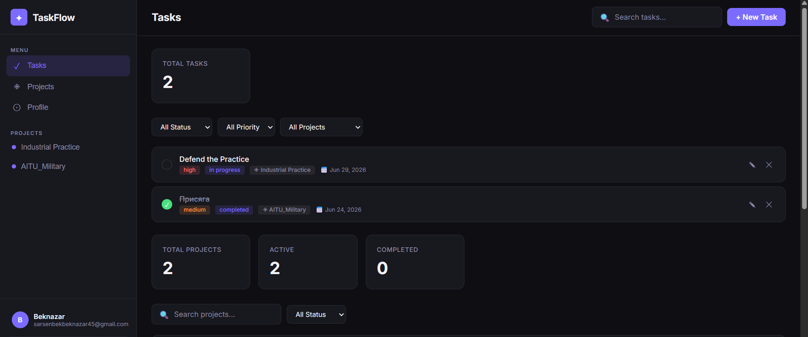

# TaskFlow — Task Manager Application

A full-stack task management web application built with Node.js, Express, MongoDB, and vanilla JavaScript.

---

## Project Overview

TaskFlow allows users to create, organize, and track tasks and projects with full authentication, search, filtering, and pagination. The app supports both light and dark themes and is fully responsive across desktop, tablet, and mobile devices.

**Key Features:**
- User registration and login with JWT authentication
- Create, edit, delete, and complete tasks
- Organize tasks into projects with color labels
- Search tasks and projects by keyword
- Filter by status, priority, and project
- Pagination for all resource listings
- Profile page with account statistics
- Light / Dark theme preference saved per user
- Fully responsive UI (mobile, tablet, desktop)

---

## Tech Stack

| Layer    | Technology                        |
|----------|-----------------------------------|
| Frontend | HTML5, CSS3, Vanilla JavaScript   |
| Backend  | Node.js, Express.js               |
| Database | MongoDB (Mongoose ODM)            |
| Auth     | JWT (jsonwebtoken) + bcryptjs     |
| Validation | Joi                             |

---

## Project Structure

```
taskflow/
├── backend/
│   ├── middleware/
│   │   ├── auth.js           # JWT protect middleware
│   │   ├── errorHandler.js   # Global error handler
│   │   └── validate.js       # Joi validation schemas
│   ├── models/
│   │   ├── User.js           # User schema (bcrypt hashing)
│   │   ├── Task.js           # Task schema
│   │   └── Project.js        # Project schema
│   ├── routes/
│   │   ├── auth.js           # POST /register, POST /login
│   │   ├── user.js           # GET /profile, PUT /preferences
│   │   ├── tasks.js          # Full CRUD + search/filter/pagination
│   │   └── projects.js       # Full CRUD + search/filter/pagination
│   ├── .env                  # Environment variables (not committed)
│   ├── package.json
│   └── server.js             # Express app entry point
└── frontend/
    ├── css/
    │   ├── auth.css          # Auth page styles
    │   └── dashboard.css     # Dashboard styles + responsive
    ├── js/
    │   └── api.js            # Fetch wrapper for all API calls
    └── pages/
        ├── auth.html         # Sign In / Sign Up page
        └── dashboard.html    # Main app (Tasks, Projects, Profile)
```

---

## Setup Instructions

### Prerequisites
- Node.js v18 or higher
- npm
- Internet connection (MongoDB Atlas is used)

### Installation

```bash
# 1. Navigate to the backend folder
cd taskflow/backend

# 2. Install dependencies
npm install

# 3. Start the server
npm start
```

The server starts on **http://localhost:5000**

Open your browser and go to **http://localhost:5000** — you will see the Sign In page.

### Environment Variables

The `.env` file is already configured with MongoDB Atlas credentials:

```
MONGODB_URI=mongodb+srv://...
JWT_SECRET=my-super-secret-key-123
JWT_EXPIRES_IN=7d
PORT=5000
```

> **Note:** In production, replace `JWT_SECRET` with a long random string and never commit `.env` to version control.

---

## API Documentation

Base URL: `http://localhost:5000/api`

### Authentication

| Method | Endpoint          | Description              | Auth Required |
|--------|-------------------|--------------------------|---------------|
| POST   | /auth/register    | Register a new user      | No            |
| POST   | /auth/login       | Login and receive token  | No            |

**POST /auth/register** — Request body:
```json
{
  "name": "Alex Johnson",
  "email": "alex@example.com",
  "password": "Secret123"
}
```

**POST /auth/login** — Request body:
```json
{
  "email": "alex@example.com",
  "password": "Secret123"
}
```

Both return:
```json
{
  "success": true,
  "token": "<JWT>",
  "user": { "id": "...", "name": "...", "email": "..." }
}
```

---

### User

| Method | Endpoint             | Description              | Auth Required |
|--------|----------------------|--------------------------|---------------|
| GET    | /user/profile        | Get profile + stats      | Yes           |
| PUT    | /user/preferences    | Update theme/view        | Yes           |

---

### Tasks

| Method | Endpoint       | Description                        | Auth Required |
|--------|----------------|------------------------------------|---------------|
| GET    | /tasks         | List tasks (search/filter/paginate)| Yes           |
| POST   | /tasks         | Create a task                      | Yes           |
| PUT    | /tasks/:id     | Update a task                      | Yes           |
| DELETE | /tasks/:id     | Delete a task                      | Yes           |

**GET /tasks — Query Parameters:**

| Param    | Type   | Description                          |
|----------|--------|--------------------------------------|
| search   | string | Search title and description         |
| status   | string | `todo` \| `in_progress` \| `completed` |
| priority | string | `low` \| `medium` \| `high`          |
| project  | string | Filter by project ID                 |
| page     | number | Page number (default: 1)             |
| limit    | number | Items per page (default: 10)         |

Example:
```
GET /api/tasks?search=meeting&status=todo&priority=high&page=1&limit=10
```

**POST /tasks** — Request body:
```json
{
  "title": "Finish report",
  "description": "Complete Q2 financial report",
  "status": "todo",
  "priority": "high",
  "dueDate": "2026-07-01",
  "project": "<project_id>"
}
```

---

### Projects

| Method | Endpoint         | Description                          | Auth Required |
|--------|------------------|--------------------------------------|---------------|
| GET    | /projects        | List projects (search/filter/paginate)| Yes          |
| POST   | /projects        | Create a project                     | Yes           |
| PUT    | /projects/:id    | Update a project                     | Yes           |
| DELETE | /projects/:id    | Delete a project                     | Yes           |

**GET /projects — Query Parameters:**

| Param  | Type   | Description                              |
|--------|--------|------------------------------------------|
| search | string | Search name and description              |
| status | string | `active` \| `completed` \| `archived`   |
| page   | number | Page number (default: 1)                 |
| limit  | number | Items per page (default: 20)             |

---

## Database Schema

### User
| Field       | Type    | Description                    |
|-------------|---------|--------------------------------|
| name        | String  | Full name (2–50 chars)         |
| email       | String  | Unique, lowercase              |
| password    | String  | Hashed with bcrypt (hidden)    |
| avatar      | String  | Avatar URL (optional)          |
| preferences | Object  | `{ theme, defaultView }`       |
| createdAt   | Date    | Auto-generated                 |

### Task
| Field       | Type     | Description                              |
|-------------|----------|------------------------------------------|
| title       | String   | Required (2–200 chars)                   |
| description | String   | Optional (max 1000 chars)               |
| status      | String   | `todo` / `in_progress` / `completed`    |
| priority    | String   | `low` / `medium` / `high`               |
| dueDate     | Date     | Optional                                 |
| tags        | [String] | Array of tags                            |
| owner       | ObjectId | Reference to User                        |
| project     | ObjectId | Reference to Project (optional)          |

### Project
| Field       | Type     | Description                             |
|-------------|----------|-----------------------------------------|
| name        | String   | Required (2–100 chars)                  |
| description | String   | Optional (max 500 chars)               |
| color       | String   | Hex color (default: #6366f1)            |
| status      | String   | `active` / `completed` / `archived`    |
| owner       | ObjectId | Reference to User                       |

---

## Deployment

The application can be deployed to [Render](https://practice-project-99df.onrender.com):

1. Push project to GitHub
2. Create a new **Web Service** on Render
3. Set **Root Directory** to `taskflow/backend`
4. Set **Build Command** to `npm install`
5. Set **Start Command** to `npm start`
6. Add environment variables from `.env` in Render dashboard

> Deployment link: *(add your link here after deploying)*

---

## Security

- Passwords hashed with **bcrypt** (salt rounds: 12)
- Authentication via **JWT** tokens (7-day expiry)
- All resource routes protected by `protect` middleware
- Input validation with **Joi** on register, login, task, and project creation
- Environment variables for all sensitive credentials
- Users can only access their own tasks and projects

---

## Frontend Validation

The auth page validates the following before submitting:

| Field    | Validation                                      |
|----------|-------------------------------------------------|
| Name     | Minimum 2 characters                           |
| Email    | Valid email format (`x@x.x`)                   |
| Password | 6+ chars, must include uppercase, lowercase, number |

Real-time password strength hints are shown while typing.

---

## Local Storage Usage

| Key         | Value                        | Purpose                        |
|-------------|------------------------------|--------------------------------|
| tf_token    | JWT string                   | Auth token for API calls       |
| tf_user     | JSON user object             | Quick user display on load     |
| tf_theme    | `"light"` or `"dark"`        | Persist theme preference       |
| tf_filters  | JSON `{search,status,...}`   | Restore last search/filter state |

